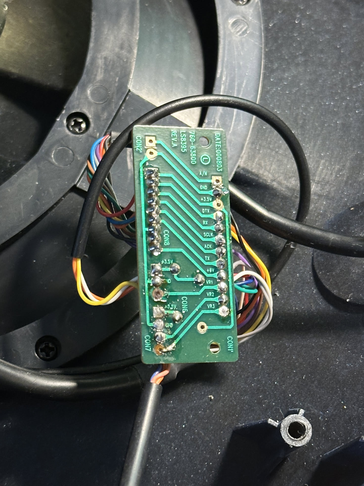

# ps1-steering-wheel-to-pc

This will be used as a place to document my progress on trying to convert an old PlayStation one Lotus steering wheel I found in my loft into working with my computer as a controller for games etc.

![[wheel-base-before.png]]
![[pedals-before.png]]

I had previously worked on this wheel in 2022 to achieve a similar goal, but I had only managed to tap into the potentiometer of the wheel and the two connected pedals with an arduino, and then map the values to a virtual xbox 360 controller.
This was good enough for a sixth form project, but it was super janky having a bulky wheel and having to reach my keyboard and mouse to navigate menus in games. 

I have returned now to upgrade it to get full controller support with the front facing buttons and paddles.

Taking apart the wheel previously, I firstly discovered a small pcb that took a bunch of wires from within the wheel, along with the data from the potentiometers, then puts it into the old playstation 9 pin connector. 

![[bridge-pcb-before.png]]

To get my 'sixth form level' project working (with a pretty weak idea of what I was doing), I soldered some jumper wires from an Arduino nano to the pcb's pads for the three potentiometers (The wheel's angle, the accelerator, and break pedals).

![[bridge-pcb-before-connected.png]]

As this photo shows, it was a pretty shoddy job, I also didn't want to make any irreversable changes to the wheel in anyway, so attaching the arduino like a parasite to the wheel was the only way to complete the project.

From there, I had the arduino spit out the raw values of the potentiometers (0 to 1023) to a C# program (it was the only language I knew in sixth form) that read the serial data sent from the arduino and mapped the values to a virtual xbox 360 controller made using Nefarius' ViGEm library.

17th September 2025:

